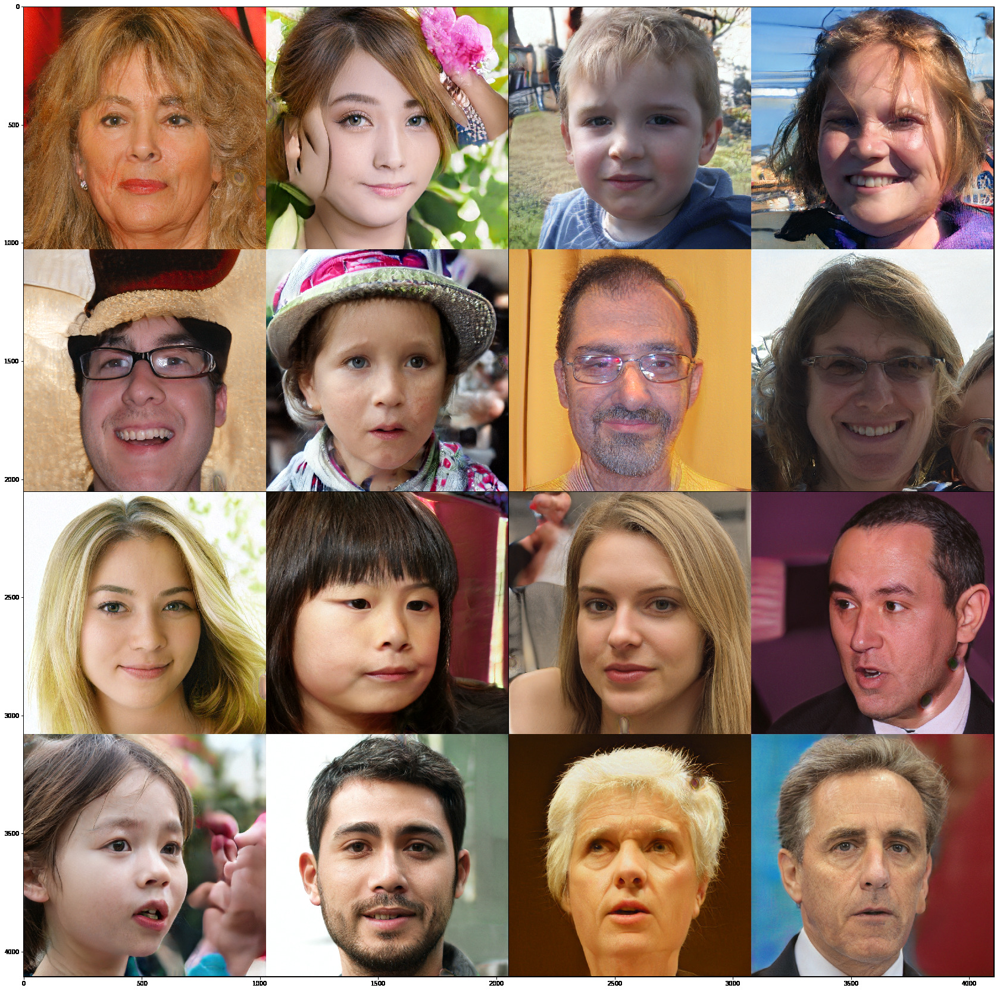

# Pytorch Hub StyleGAN

This is a fork of [lernapparat/lernapparat](https://github.com/lernapparat/lernapparat) to make it available via Pytorch Hub.

([lernapparat/lernapparat](https://github.com/lernapparat/lernapparat) itself is a Pytorch implementation of [NVlabs/stylegan](https://github.com/NVlabs/stylegan), using the same / official weights)

Pytorch Hub makes it extremely easy to load the Style GAN model and pretrained weights:

```python
import torch

model = torch.hub.load('ndahlquist/lernapparat:0.0.1', 'style_gan', pretrained=True)

# done! so easy!
```

See [Torch Hub Example.ipynb](Torch%20Hub%20Example.ipynb) for a complete example



## License

The weights are taken from the reference implementation distributed by NVidia Corporation as Licensed under the `CC-BY-NC 4.0` license. As such, the same applies here.
